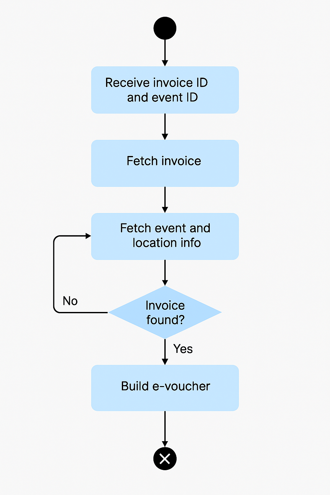

# EVoucher API

Detta projekt tillhandahåller ett API för att generera e-vouchers (digitala biljetter) baserade på information 
från flera källor, inklusive fakturor, events och platsdata. API:et aggregerar data och returnerar ett komplett 
e-voucher-objekt med information om evenemang, kund och plats.

---

## Funktionalitet

- 🔗 Hämtar fakturainformation via Invoice API
- 🗓 Hämtar eventinformation via Event API
- 🗺 Hämtar platsinformation via gRPC (Location API)
- 🧾 Returnerar en komplett `EVoucher` som JSON
- ❌ Inkluderar regler för förbjudna föremål och villkor

---

## Flöde – Aktivitetsdiagram

---

