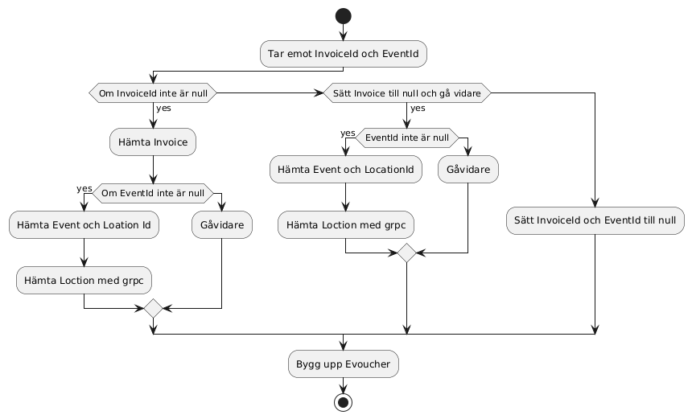

# EVoucher API

Detta projekt tillhandahåller ett API för att generera e-vouchers (digitala biljetter) baserade på information 
från flera källor, inklusive fakturor, events och platsdata. API:et aggregerar data och returnerar ett komplett 
e-voucher-objekt med information om evenemang, kund och plats.

---

## Funktionalitet

-  Hämtar fakturainformation via Invoice API
-  Hämtar eventinformation via Event API
-  Hämtar platsinformation via gRPC (Location API)
-  Returnerar en komplett `EVoucher` som JSON

---

## Flöde – Aktivitetsdiagram

1. Verifiera InvoiceId
2. Om InvoiceId är null, gå vidare
3. Hämtar fakturainformation via Invoice API
4. Verifiera EventId
5. Om EventId är null, gå vidare
6. Hämtar eventinformation via Event API
7. Hämtar platsinformation med hjälp av  locationid från event via gRPC (Location API)
8. Bygg upp Evoucher

---

